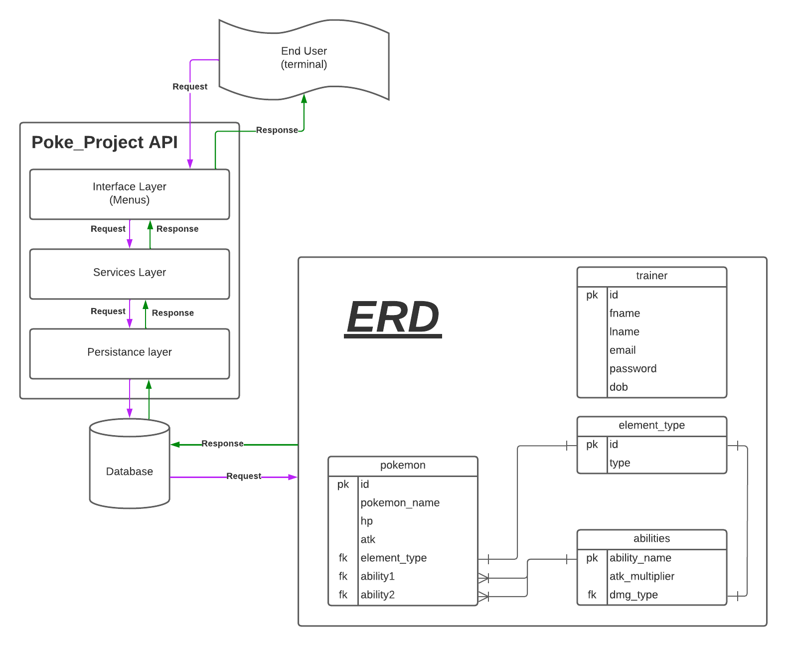

# Welcome to the Poke Project

## Description

This is a project to be able to enter in new pokemon and view information on them for trainers. 
This is similar to a pokedex for trainers to allow them the ability to log in a register new pokemon.
This project is current working as a backend only, the front end will be included in another repo at a later date.

## User Story

- [ ] As a new trainer, I should be able to register myself on the system, so that I can begin using the poke project application.
- [ ] As a trainer, I should be able to log in once I've registered so that I can access the information in the database about all the known pokemon.
- [ ] As a trainer, I should be able to view all other trainers, so that I can contact any other trainers to maybe form a party.
- [ ] As a trainer I should be able to view all register pokemon, so that I can gain insight into all the pokemon's attributes I may one day own or face in a pokemon fight.
- [ ] As a trainer, I should be able to register a new pokemon into the database so that I can share this information with other trainers in the system.
- [ ] As a trainer, I should be able to update any information for a pokemon, so that I can help ensure the most accurate pokedex possible.
- [ ] As a trainer, I should be able to remove any pokemon so that any accidental or no longer relevant entries are contained within the database.
- [ ] As a trainer, I should be able to add/update/delete any abilities so that any new abilities for pokemon that I encounter can be accurate.

## Tech Stack

- Java 8 JDK
- Apache Maven 3
- Tomcat 10 Servlets
- Local PostgreSQL (eventually hosted on Azure)
- Git SCM (GitHub)
- HTML/CSS/JS

## Installation

- Currently the application only requires that you have Java 8, a postgresql database and maven installed on your system.
- Pull down the git repository with the following commands

```bash
# Follow these steps to build the API from the CLI
git clone https://github.com/SyntaxError-JARS/poke_project.git
cd poke_project

git checkout pokedex_maven

# Generate a db.properties file and fill out the appropriate information for
# you database. Fill after each "=" the according information.
printf "url=\nuser=\npassword=\n" > src/main/resources/db.properties
```

- Next make sure to run the pokedex-script.sql script file in the src/main/resources directory to obtain all the appropriate tables. Note: make sure you're working within the appropriate schema for you database.
- Finally, boot up the java application and use the MainDriver to access the menus that allow for requests to be made to the databse.

## Project Structure

